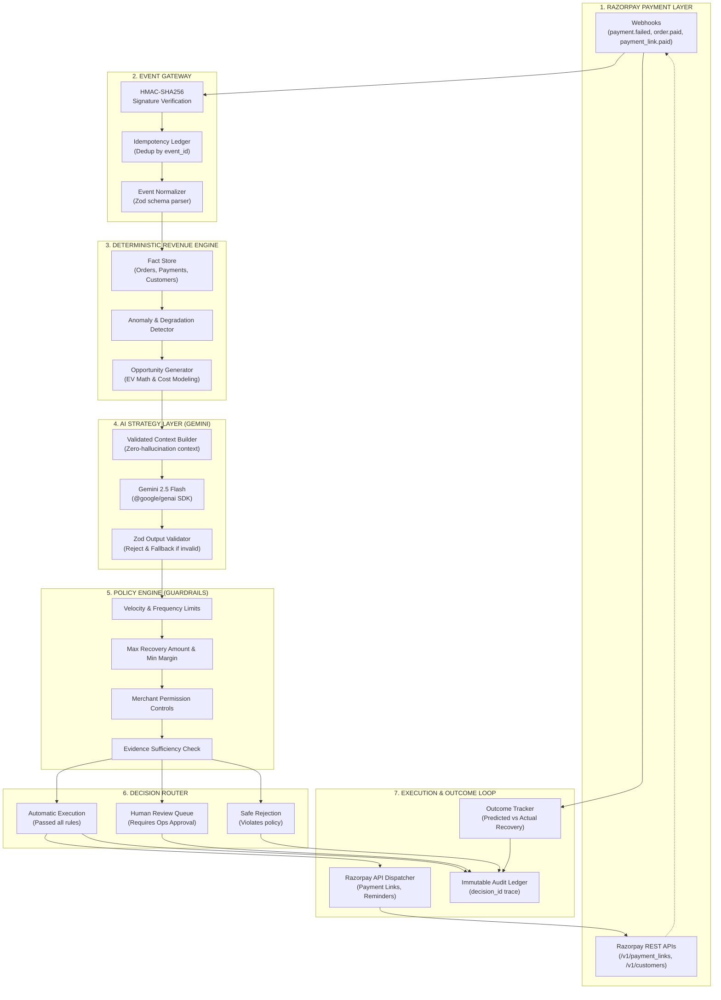

# MerchantPulse ⚡

> **AI-Assisted Autonomous Revenue Intelligence for Razorpay Merchants**  
> *Razorpay Buildathon Submission — AI Growth & Agentic Commerce Track*

---

## 🎯 The Core Thesis

Digital merchants lose between 3% to 7% of their gross merchandise value (GMV) to payment failures, checkout dropoffs, and issuer degradations. Generic dashboards only report what was lost, while naive LLM bots hallucinate numbers or trigger risky, unconstrained actions.

**MerchantPulse** bridges deterministic payment infrastructure with AI strategy reasoning:
```
Observed Payment Event → Deterministic Analysis → AI Strategy → Economic Decision → Policy Validation → Valid Execution → Closed-Loop Outcome → Audit Trail
```

```
┌─────────────────────────────────────────────────────────────────────────────┐
│                             MERCHANTPULSE CREED                             │
│                                                                             │
│  "Code establishes truth.                                                   │
│   AI reasons over truth.                                                    │
│   Policy determines whether reasoning may become action.                    │
│   Valid code executes real Razorpay primitives.                             │
│   Events prove what actually happened."                                     │
└─────────────────────────────────────────────────────────────────────────────┘
```

---

## 🚫 What This Is NOT vs. ✅ What This IS

| ❌ What This Is NOT | ✅ What MerchantPulse IS |
|---|---|
| A generic chatbot answering payment questions | An event-driven revenue recovery pipeline |
| An LLM performing financial arithmetic | 100% deterministic Expected Value (EV) math in integer paise |
| A multi-agent framework created for presentation theatre | A single, testable, closed-loop revenue engine |
| Hallucinated or speculative Razorpay APIs | Built 1:1 on verified Razorpay REST & Webhook primitives |
| Using refunds as generic incentives | True recovery workflows via dynamic Payment Links & Routing |

---

## 🏗️ System Architecture



---

## 📐 Expected Economic Value (EV) Decision Model

MerchantPulse evaluates every candidate intervention using an explicit mathematical cost-benefit model before policy evaluation:

$$\text{Expected Value (EV)} = (P_{\text{success}} \times \text{Recoverable GMV}) - \text{Intervention Cost} - \text{Fatigue Penalty}$$

- **$P_{\text{success}}$**: Calibrated empirical recovery probability derived deterministically from failure code (e.g. Bank Timeout = 68%, Bad Details = 12%), modified by customer loyalty (+8% for LTV > ₹10,000) and penalized for consecutive retries (-10% per retry).
- **$\text{Recoverable GMV}$**: Exact transaction value in integer paise.
- **$\text{Intervention Cost}$**: Direct channel dispatch fee (SMS/Email gateway + Razorpay platform allocation).
- **$\text{Fatigue Penalty}$**: Attention cost ensuring merchants do not spam customers for micro-transactions with negative EV.

---

## 🛡️ Policy Engine Guardrails

Even when the AI proposes an action with high confidence, it cannot execute without passing through 6 deterministic policy gates:

1. **State Consistency**: Opportunity must be in an active, non-terminal state.
2. **Action Allowlist**: Action must be explicitly enabled in merchant policy configuration.
3. **Economic Profitability Gate**: Net EV must exceed the minimum margin threshold ($\ge$ ₹20.00).
4. **Customer Contact Frequency Cap**: Enforces a strict 24-hour cooldown per customer to prevent communication spam.
5. **Action Evidence Sufficiency**: Valid phone/email/order parameters must exist to dispatch the Razorpay primitive.
6. **Maximum Autonomous GMV Threshold**: Transactions above ₹25,000 are automatically routed to the **Human Review Queue** for manual approval.

---

## ⚡ Verified Razorpay Capabilities Mapping

| Capability | Official Razorpay API / Webhook | Purpose in MerchantPulse |
|---|---|---|
| **Payment Webhook: Failed** | `payment.failed` | Instant trigger for payment dropoff & recovery analysis |
| **Payment Webhook: Captured** | `payment.captured` | Revenue tracking & organic conversion baseline |
| **Order Webhook: Paid** | `order.paid` | Checkout funnel completion verification |
| **Payment Links: Create** | `POST /v1/payment_links` | Dynamic personalized payment link generation with expiry |
| **Payment Links: Cancel** | `POST /v1/payment_links/:id/cancel` | Invalidate stale links upon SLA expiration |
| **Payment Link Webhook: Paid** | `payment_link.paid` | Closed-loop recovery outcome attribution |
| **Webhook Signature Verification** | `x-razorpay-signature` | Cryptographic HMAC-SHA256 raw body validation |

*Full documentation: [`docs/razorpay-capabilities.md`](./docs/razorpay-capabilities.md)*

---

## 🧪 Evaluation Benchmark Results (10/10 Passing)

MerchantPulse includes a comprehensive 10-scenario synthetic evaluation test harness:

| Scenario ID | Test Scenario | Verified System Behavior | Result |
|---|---|---|---|
| `SCEN-001` | High-Value Dropoff Recovery | Auto-executed `POST /v1/payment_links` with SMS & 2h expiry | **PASS (100%)** |
| `SCEN-002` | Over-Limit GMV Protection (₹85,000) | Blocked autonomous API call; escalated to Human Queue | **PASS (100%)** |
| `SCEN-003` | Negative EV Suppression (₹30 order) | Prevented unprofitable recovery attempt | **PASS (100%)** |
| `SCEN-004` | Customer Fatigue Protection (<24h) | Blocked repeat contact; logged audit reason | **PASS (100%)** |
| `SCEN-005` | Duplicate Webhook Delivery | Deduplicated via `x-razorpay-event-id` idempotency ledger | **PASS (100%)** |
| `SCEN-006` | Webhook Signature Tampering | Constant-time HMAC-SHA256 rejected invalid signature | **PASS (100%)** |
| `SCEN-007` | Malformed AI Output Schema Defense | Strict Zod validation intercepted invalid output & used fallback | **PASS (100%)** |
| `SCEN-008` | Gateway Degradation Anomaly | Detected 66% failure spike on bank node & generated advisory | **PASS (100%)** |
| `SCEN-009` | Closed-Loop Outcome Attribution | Matched `payment_link.paid` to original `decision_id` & GMV | **PASS (100%)** |
| `SCEN-010` | Expired Link Resolution | Closed uncompleted recovery link upon timeout | **PASS (100%)** |

```bash
npm run test:eval
# ✓ tests/evaluation/benchmark.test.ts (10 tests passed)
```

---

## 🚀 Quickstart & Local Demo

### 1. Prerequisites
- Node.js 18+ (tested on Node 22)
- npm 9+

### 2. Installation
```bash
git clone https://github.com/divyanshusinha/merchantpulse.git
cd merchantpulse
npm install
```

### 3. Environment Setup (Optional)
```bash
cp .env.example .env.local
# Add GEMINI_API_KEY and RAZORPAY_KEY_ID / SECRET if testing live integrations.
# If omitted, MerchantPulse runs 100% deterministically in offline demo mode.
```

### 4. Run Development Server
```bash
npm run dev
# Open http://localhost:3000 in your browser
```

### 5. Run Verification & Test Suites
```bash
npm run test        # Runs all 41 unit & integration tests
npm run test:eval   # Runs the 10-scenario evaluation benchmark matrix
npm run type-check  # Verifies strict TypeScript type safety
npm run build       # Next.js production build verification
```

---

## 💼 Why Razorpay Should Care (Hiring & Product Value)

1. **Fintech Engineering Maturity**: Understands that LLMs must never own accounting totals, balances, or execution authority. Code establishes truth, AI reasons over truth, and policy governs action.
2. **Native Razorpay Ecosystem Thinking**: Built directly on top of Razorpay's core strengths (Payment Links, Webhook signatures, idempotent event processing, and multi-channel notification APIs).
3. **Measurable Merchant ROI**: Directly drives incremental payment volume (GMV) by turning failed transactions into recovered revenue with quantifiable closed-loop attribution.
4. **Production-Ready Rigor**: 41 comprehensive tests, zero compiler warnings, responsive financial terminal UX, and an immutable decision audit trail for complete compliance.

---

## 📄 License & Attribution
Built by Divyanshu Sinha for the Razorpay Buildathon 2026.
Licensed under the [MIT License](./LICENSE).
