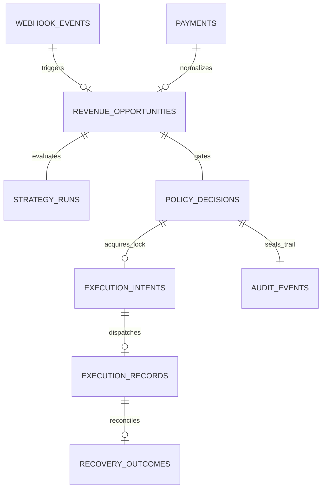

# 🏛️ MerchantPulse Database Schema & Audit Ledger Specification

**Target Database:** PostgreSQL 15+ / Supabase  
**Core File:** [`supabase/schema.sql`](file:///Users/divyanshusinha/RazorPay/supabase/schema.sql)  
**Security Model:** Row-Level Security (RLS) enabled on all tables  
**Accounting Invariant:** Strictly append-only, zero financial double-counting, non-overlapping attribution  

---

## 1. Architectural Overview & Entity-Relationship Model



---

## 2. Core SQL Schema (DDL)

```sql
-- ====================================================================
-- 1. Webhook Events (Append-Only Log for Inbound Razorpay Webhooks)
-- ====================================================================
CREATE TABLE IF NOT EXISTS public.webhook_events (
    id UUID PRIMARY KEY DEFAULT gen_random_uuid(),
    event_id VARCHAR(128) NOT NULL UNIQUE,
    event_type VARCHAR(64) NOT NULL,
    merchant_id VARCHAR(64) NOT NULL DEFAULT 'rzp_merchant_main',
    raw_payload JSONB NOT NULL,
    signature VARCHAR(256),
    signature_verified BOOLEAN NOT NULL DEFAULT false,
    processed_status VARCHAR(32) NOT NULL DEFAULT 'PENDING',
    error_message TEXT,
    received_at TIMESTAMPTZ NOT NULL DEFAULT timezone('utc'::text, now()),
    created_at TIMESTAMPTZ NOT NULL DEFAULT timezone('utc'::text, now())
);

CREATE INDEX IF NOT EXISTS idx_webhook_events_merchant_id ON public.webhook_events(merchant_id);
CREATE INDEX IF NOT EXISTS idx_webhook_events_event_type ON public.webhook_events(event_type);
CREATE INDEX IF NOT EXISTS idx_webhook_events_received_at ON public.webhook_events(received_at DESC);

-- ====================================================================
-- 2. Revenue Opportunities (Detected Failures with Deterministic EV)
-- ====================================================================
CREATE TABLE IF NOT EXISTS public.revenue_opportunities (
    id VARCHAR(128) PRIMARY KEY, -- opp_...
    merchant_id VARCHAR(64) NOT NULL,
    payment_id VARCHAR(128) REFERENCES public.payments(id) ON DELETE SET NULL,
    order_id VARCHAR(128),
    amount_paise BIGINT NOT NULL,
    type VARCHAR(64) NOT NULL,
    status VARCHAR(32) NOT NULL DEFAULT 'DETECTED',
    customer_name VARCHAR(128),
    customer_contact VARCHAR(64),
    customer_email VARCHAR(128),
    
    -- Deterministic EV Breakdown (Paise)
    p_success NUMERIC(5, 4) NOT NULL,
    recoverable_gmv_paise BIGINT NOT NULL,
    intervention_cost_paise BIGINT NOT NULL,
    net_expected_value_paise BIGINT NOT NULL,
    
    evidence JSONB NOT NULL DEFAULT '{}'::jsonb,
    created_at TIMESTAMPTZ NOT NULL DEFAULT timezone('utc'::text, now()),
    updated_at TIMESTAMPTZ NOT NULL DEFAULT timezone('utc'::text, now())
);

CREATE INDEX IF NOT EXISTS idx_opportunities_merchant_id ON public.revenue_opportunities(merchant_id);
CREATE INDEX IF NOT EXISTS idx_opportunities_status ON public.revenue_opportunities(status);

-- ====================================================================
-- 3. Execution Intents (Concurrency & Idempotency State Machine)
-- ====================================================================
CREATE TABLE IF NOT EXISTS public.execution_intents (
    intent_key VARCHAR(256) PRIMARY KEY, -- intent_merchant_oppId_actionType
    opportunity_id VARCHAR(128) NOT NULL REFERENCES public.revenue_opportunities(id) ON DELETE CASCADE,
    merchant_id VARCHAR(64) NOT NULL,
    action_type VARCHAR(64) NOT NULL,
    state VARCHAR(32) NOT NULL, -- EXECUTION_REQUESTED | EXECUTION_IN_FLIGHT | EXECUTION_SUCCEEDED | EXECUTION_FAILED
    execution_record_id VARCHAR(128),
    created_at TIMESTAMPTZ NOT NULL DEFAULT timezone('utc'::text, now()),
    updated_at TIMESTAMPTZ NOT NULL DEFAULT timezone('utc'::text, now())
);

-- ====================================================================
-- 4. Recovery Outcomes (Reconciliation Evidence)
-- ====================================================================
CREATE TABLE IF NOT EXISTS public.recovery_outcomes (
    id UUID PRIMARY KEY DEFAULT gen_random_uuid(),
    decision_id VARCHAR(128) NOT NULL,
    opportunity_id VARCHAR(128) NOT NULL,
    merchant_id VARCHAR(64) NOT NULL,
    attribution_type VARCHAR(64) NOT NULL, -- ATTRIBUTED_INTERVENTION | ORGANIC_RECOVERY | REJECTED_UNATTRIBUTED
    status VARCHAR(32) NOT NULL, -- RECOVERED | EXPIRED | PENDING | REJECTED
    reconciled_amount_paise BIGINT NOT NULL DEFAULT 0,
    resolution_event_id VARCHAR(128),
    reconciled_payment_id VARCHAR(128),
    notes TEXT,
    reconciled_at TIMESTAMPTZ NOT NULL DEFAULT timezone('utc'::text, now()),
    created_at TIMESTAMPTZ NOT NULL DEFAULT timezone('utc'::text, now()),
    CONSTRAINT uq_recovery_decision UNIQUE (decision_id)
);

-- ====================================================================
-- 5. Audit Events (Immutable Append-Only Audit Trail)
-- ====================================================================
CREATE TABLE IF NOT EXISTS public.audit_events (
    id UUID PRIMARY KEY DEFAULT gen_random_uuid(),
    decision_id VARCHAR(128) NOT NULL,
    opportunity_id VARCHAR(128) NOT NULL,
    event_id VARCHAR(128) NOT NULL,
    merchant_id VARCHAR(64) NOT NULL,
    action_status VARCHAR(32) NOT NULL,
    executed_action_id VARCHAR(128),
    deterministic_metrics JSONB NOT NULL,
    ai_recommendation JSONB NOT NULL,
    policy_result JSONB NOT NULL,
    outcome JSONB NOT NULL,
    recorded_at TIMESTAMPTZ NOT NULL DEFAULT timezone('utc'::text, now())
);

CREATE INDEX IF NOT EXISTS idx_audit_events_merchant_id ON public.audit_events(merchant_id);
CREATE INDEX IF NOT EXISTS idx_audit_events_decision_id ON public.audit_events(decision_id);
CREATE INDEX IF NOT EXISTS idx_audit_events_opp_id ON public.audit_events(opportunity_id);
```

---

## 3. Sample Ledger Records

### Record 1: Auto-Approved Recovery (< ₹25,000 Cap, High EV)
```json
{
  "table": "audit_events",
  "decisionId": "dec_20260903_001",
  "opportunityId": "opp_pay_dropoff_001",
  "eventId": "evt_wh_pay_failed_8819",
  "merchantId": "rzp_merchant_pulse",
  "actionStatus": "EXECUTED",
  "executedActionId": "plink_TXddgWqH37CXQx",
  "deterministicMetrics": {
    "amountPaise": 850000,
    "pSuccess": 0.68,
    "recoverableGmvPaise": 850000,
    "interventionCostPaise": 1500,
    "expectedValuePaise": 576500,
    "isProfitable": true
  },
  "policyResult": {
    "verdict": "AUTO_EXECUTE",
    "primaryReason": "Transaction is profitable (EV = ₹5,765) and within auto-cap limit (₹8,500 <= ₹25,000).",
    "evaluatedRules": [
      { "ruleName": "MAX_AUTO_GMV_CAP", "passed": true, "details": "850000 <= 2500000" },
      { "ruleName": "MINIMUM_EXPECTED_VALUE", "passed": true, "details": "576500 >= 2000" },
      { "ruleName": "CUSTOMER_COOLDOWN", "passed": true, "details": "0 contacts in last 24h" }
    ]
  },
  "outcome": {
    "status": "RECOVERED",
    "attributionType": "ATTRIBUTED_INTERVENTION",
    "reconciledAmountPaise": 850000,
    "resolutionEventId": "evt_wh_plink_paid_9901",
    "reconciledPaymentId": "pay_live_rec_4412"
  },
  "recordedAt": "2026-09-03T16:58:50Z"
}
```

### Record 2: Escalated to Human Ops (> ₹25,000 Safety Policy Violation)
```json
{
  "table": "audit_events",
  "decisionId": "dec_20260903_002",
  "opportunityId": "opp_pay_large_enterprise_004",
  "eventId": "evt_wh_pay_failed_9012",
  "merchantId": "rzp_merchant_pulse",
  "actionStatus": "ESCALATED",
  "executedActionId": null,
  "deterministicMetrics": {
    "amountPaise": 5655300,
    "pSuccess": 0.66,
    "recoverableGmvPaise": 5655300,
    "interventionCostPaise": 1500,
    "expectedValuePaise": 3731000,
    "isProfitable": true
  },
  "policyResult": {
    "verdict": "ESCALATE_HUMAN",
    "primaryReason": "Amount ₹56,553 exceeds maximum autonomous execution threshold of ₹25,000.",
    "evaluatedRules": [
      { "ruleName": "MAX_AUTO_GMV_CAP", "passed": false, "details": "5655300 > 2500000" },
      { "ruleName": "MINIMUM_EXPECTED_VALUE", "passed": true, "details": "3731000 >= 2000" }
    ]
  },
  "outcome": {
    "status": "PENDING",
    "attributionType": "UNRESOLVED",
    "reconciledAmountPaise": 0
  },
  "recordedAt": "2026-09-03T17:02:11Z"
}
```

### Record 3: Suppressed by Policy (Customer Frequency Fatigue Cooldown Active)
```json
{
  "table": "audit_events",
  "decisionId": "dec_20260903_003",
  "opportunityId": "opp_pay_retry_churn_007",
  "eventId": "evt_wh_pay_failed_9115",
  "merchantId": "rzp_merchant_pulse",
  "actionStatus": "REJECTED",
  "executedActionId": null,
  "deterministicMetrics": {
    "amountPaise": 120000,
    "pSuccess": 0.42,
    "recoverableGmvPaise": 120000,
    "interventionCostPaise": 1500,
    "expectedValuePaise": 48900,
    "isProfitable": true
  },
  "policyResult": {
    "verdict": "REJECT",
    "primaryReason": "Customer fatigue threshold reached: customer has already received 2 interventions in last 24h.",
    "evaluatedRules": [
      { "ruleName": "CUSTOMER_COOLDOWN", "passed": false, "details": "Last contact was 3.2 hours ago (cooldown is 24 hours)" }
    ]
  },
  "outcome": {
    "status": "REJECTED",
    "attributionType": "REJECTED_UNATTRIBUTED",
    "reconciledAmountPaise": 0
  },
  "recordedAt": "2026-09-03T17:15:20Z"
}
```

---

## 4. Verification SQL Queries

### Query 1: Zero Double-Counting Guarantee
Verifies that no single decision or executed payment link is credited more than once.
```sql
SELECT 
    decision_id, 
    COUNT(*) as recovery_count, 
    SUM(reconciled_amount_paise) / 100 as total_recovered_inr
FROM public.recovery_outcomes
WHERE status = 'RECOVERED'
GROUP BY decision_id
HAVING COUNT(*) > 1;
-- EXPECTED RESULT: 0 rows (guarantees zero double counting)
```

### Query 2: Organic vs Attributed GMV Segregation
Proves strict separation between MerchantPulse recovery actions and baseline organic retries.
```sql
SELECT 
    attribution_type,
    COUNT(*) as total_events,
    SUM(reconciled_amount_paise) / 100 as gmv_inr,
    ROUND(SUM(reconciled_amount_paise)::numeric / NULLIF((SELECT SUM(reconciled_amount_paise) FROM public.recovery_outcomes), 0) * 100, 2) as pct_of_total
FROM public.recovery_outcomes
GROUP BY attribution_type;
```

### Query 3: Policy Compliance Audit
Audits that no autonomous action exceeded the ₹25,000 safety threshold without explicit human escalation.
```sql
SELECT 
    ae.decision_id,
    ae.opportunity_id,
    (ae.deterministic_metrics->>'amountPaise')::bigint / 100 as amount_inr,
    ae.action_status,
    ae.policy_result->>'verdict' as verdict
FROM public.audit_events ae
WHERE (ae.deterministic_metrics->>'amountPaise')::bigint > 2500000
  AND ae.action_status = 'EXECUTED'
  AND ae.policy_result->>'verdict' = 'AUTO_EXECUTE';
-- EXPECTED RESULT: 0 rows (verifies hard enforcement of auto-cap limit)
```
