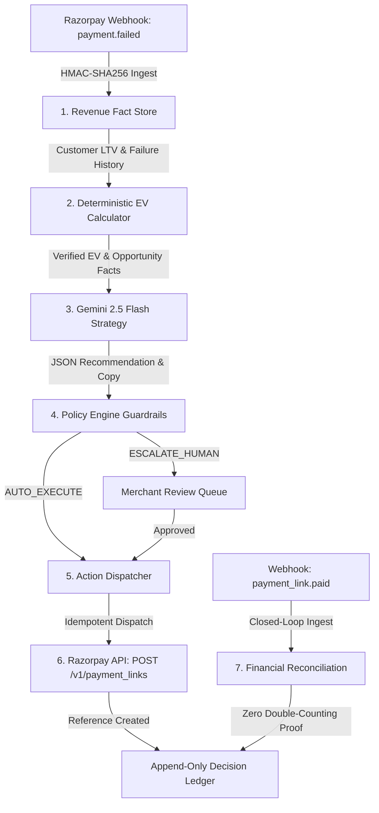

# MerchantPulse System Architecture & Technical Specifications

**Submission:** Razorpay Buildathon 2026 — Track 03: AI Revenue Recovery Agent  
**Author:** Divyanshu Sinha

---

## 🏛️ Core Philosophy: Zero-Trust Financial Isolation

MerchantPulse operates on a fundamental separation of responsibilities:
```
┌─────────────────────────────────────────────────────────────────────────────┐
│                             SAFETY BOUNDARY                                 │
│                                                                             │
│  1. Code establishes truth (Deterministic paise arithmetic, Fact Store).    │
│  2. AI reasons over truth (Gemini 2.5 Flash, Bounded Action Allowlist).    │
│  3. Policy decides action (6 safety guardrails, GMV caps, Cooldowns).       │
│  4. Razorpay executes primitives (Payment Links API, Dynamic Expiry).       │
│  5. Webhooks prove what happened (Zero double-counting reconciliation).     │
└─────────────────────────────────────────────────────────────────────────────┘
```

---

## 📐 End-to-End 7-Stage Pipeline



---

## 🔍 Detailed Component Breakdown

### 1. Ingestion & Fact Store Layer (`core/revenue/factStore.ts`)
- **HMAC Verification:** Validates raw webhook signatures using `crypto.timingSafeEqual`.
- **Idempotency Gate:** Detects and skips duplicated webhook delivery attempts.
- **Customer Fact Profile:** Tracks customer lifetime value (LTV), previous successful orders, and contact history.

### 2. Deterministic Economic Value Engine (`core/revenue/metrics.ts`)
- **Integer Paise Arithmetic:** Zero floating-point rounding errors or precision loss.
- **Expected Value (EV) Formulation:**
  $$\text{Net EV} = (P_{\text{success}} \times \text{Recoverable GMV}) - \text{Intervention Cost} - \text{Fatigue Penalty}$$
- **Cohort Calibration:** Success probabilities are empirically calibrated against customer intent, failure type, and gateway uptime.

### 3. AI Strategy Reasoning Layer (`core/strategy/provider.ts` & `integrations/gemini/client.ts`)
- **Bounded Agency:** Gemini 2.5 Flash receives read-only facts and is strictly constrained to an action allowlist:
  - `CREATE_PAYMENT_LINK`
  - `SEND_PAYMENT_REMINDER`
  - `NOTIFY_ALTERNATIVE_METHOD`
  - `ESCALATE_TO_OPS`
  - `NO_ACTION`
- **Output Schema Validation:** Strict Zod parsing ensures the LLM cannot hallucinate new parameters or actions.
- **Deterministic Fallback:** Automatically activates `MockStrategyProvider` with telemetry tracking if the AI endpoint is unavailable or slow.

### 4. Policy Engine & Safety Guardrails (`core/policy/evaluator.ts`)
Evaluates 6 deterministic rules before any action is executed:
1. `ACTION_ALLOWLIST`: Action must be within merchant configuration.
2. `MAX_AUTO_GMV_THRESHOLD`: Transactions over ₹25,000 automatically escalate for human approval.
3. `CONTACT_FREQUENCY_CAP`: Minimum 24-hour cooldown per customer to avoid fatigue.
4. `POSITIVE_EV_REQUIRED`: Prevents negative-ROI interventions that cost more than their expected recovery.
5. `STATE_CONSISTENCY`: Ensures payment is not already captured or expired.
6. `EVIDENCE_SUFFICIENCY`: Verifies customer contact details are valid.

### 5. Execution Intent & Concurrency Layer (`core/execution/dispatcher.ts`)
- **Intent State Machine:** `EXECUTION_IN_FLIGHT` $\rightarrow$ `EXECUTION_SUCCEEDED` / `EXECUTION_FAILED`.
- **Promise Deduplication:** Synchronously registers active in-flight promises so concurrent race conditions (100 simultaneous calls) resolve to exactly one external Razorpay API call.

### 6. Razorpay Primitive Integration (`integrations/razorpay/client.ts`)
- Calls `POST /v1/payment_links` with customer notify flags, reference IDs, and custom expiry.

### 7. Closed-Loop Financial Reconciliation (`core/revenue/reconciliation.ts`)
- **Zero Double-Counting:** Verifies decision IDs and payment IDs against in-memory and persistent sets.
- **Attribution Typing:** Distinguishes `ATTRIBUTED_INTERVENTION` from `ORGANIC_RECOVERY`, `DUPLICATE_RECOVERY_EVENT`, and `AMOUNT_MISMATCH`.

---

## 💾 Storage Architecture (`core/storage/`)

Supports zero-dependency **In-Memory Mode** for instant local demos, and production **Supabase PostgreSQL** with full schema migrations (`supabase/migrations/20260826000001_merchantpulse_core_schema.sql`).
