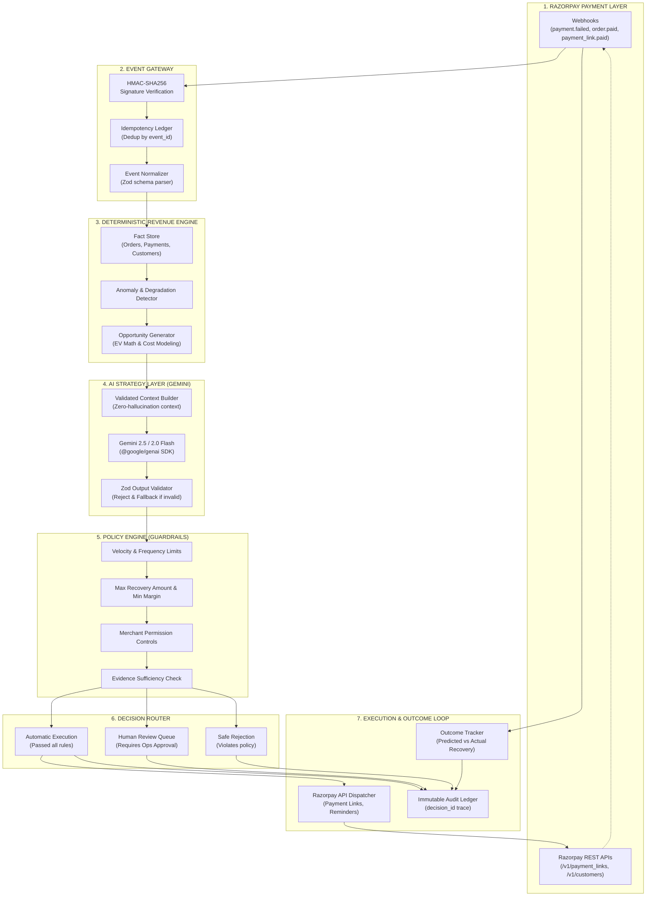

# MerchantPulse — System Architecture & Design Specification

> **AI Growth & Agentic Commerce** | Razorpay Buildathon

---

## 1. Executive Summary

MerchantPulse is an AI-assisted revenue intelligence platform for digital merchants built on Razorpay payment infrastructure. It continuously ingests payment lifecycle events, computes deterministic revenue metrics, detects high-value revenue leaks (such as failed payment drops, gateway degradations, and abandoned checkouts), uses Google Gemini to formulate intelligent recovery strategies, applies deterministic policy constraints, and executes safe, verified interventions via Razorpay APIs while maintaining an immutable end-to-end audit trail.

---

## 2. Core Architectural Principles

```
┌─────────────────────────────────────────────────────────────────────────┐
│                           MERCHANTPULSE CREED                           │
│                                                                         │
│  "Code establishes truth.                                               │
│   AI reasons over truth.                                                │
│   Policy determines whether reasoning may become action.                │
│   Code executes valid primitives.                                       │
│   Events prove what actually happened."                                 │
└─────────────────────────────────────────────────────────────────────────┘
```

1. **Deterministic Financial Authority**: The AI model is strictly prohibited from computing revenue, balances, probability-weighted expected values, or authorizing transactions. Deterministic TypeScript engines perform all math and state management.
2. **Schema-Governed AI Boundary**: All interactions with Google Gemini pass through strictly typed input contexts and validated Zod output schemas. Invalid responses are caught, logged, and routed to fallback/escalation.
3. **No Hallucinated APIs**: Interventions only execute verified Razorpay capabilities (`/v1/payment_links`, notifications, customer metadata, etc.).
4. **Idempotency & Closed-Loop Auditing**: Webhook events are processed idempotently (`x-razorpay-event-id`). Every intervention creates an immutable decision record connecting the initial trigger to the ultimate recovery outcome.

---

## 3. End-to-End System Diagram



---

## 4. Layer Architecture & Technical Specifications

### Layer 1: Event Gateway (`core/events/`, `app/api/webhooks/`)
- **Signature Verification**: Verifies incoming `x-razorpay-signature` header using HMAC-SHA256 with the merchant's webhook secret on raw request body bytes.
- **Idempotency Guard**: Deduplicates events based on `x-razorpay-event-id` or composite hash.
- **Event Normalization**: Parses Razorpay payload into strongly-typed internal domain events:
  - `PaymentFailedEvent`
  - `PaymentCapturedEvent`
  - `OrderCreatedEvent`
  - `PaymentLinkPaidEvent`
  - `PaymentLinkExpiredEvent`

### Layer 2: Deterministic Revenue Engine (`core/revenue/`)
- **Fact Store & Cohort Tracker**: Aggregates customer checkout attempts, past LTV, payment method success rates, and bank downtime signals.
- **Opportunity Detection**:
  - `HighValueFailedPayment`: Transaction value > ₹1,000 failed due to network/issuer error.
  - `PaymentMethodDegradation`: Bank/gateway failure rate exceeds moving average threshold (>30% in last 15 min).
  - `AbandonedCheckout`: High-intent order created but no payment captured within SLA.
  - `CustomerChurnRisk`: Multiple consecutive payment failures for repeat customer.
- **Expected Economic Value (EV) Decision Model**:
  $$\text{Expected Value (EV)} = (P_{\text{success}} \times \text{Recoverable GMV}) - \text{Intervention Cost} - \text{Risk Penalty}$$
  - $P_{\text{success}}$: Calibrated probability based on failure code (e.g., bank timeout has 65% retry success vs 5% for invalid card number).
  - $\text{Recoverable GMV}$: Exact transaction amount in INR.
  - $\text{Intervention Cost}$: SMS/Email notification and Razorpay processing fees.
  - $\text{Risk Penalty}$: Customer contact fatigue factor.

### Layer 3: AI Strategy Layer (`core/strategy/`, `integrations/gemini/`)
- **Strategy Provider Interface**: `RevenueStrategyProvider` with `GeminiStrategyProvider` and `MockStrategyProvider`.
- **Structured Inputs**: Zero hallucination context containing only validated transaction facts, error codes, and merchant policies.
- **Zod Validated Output**:
  ```typescript
  export const StrategyRecommendationSchema = z.object({
    opportunityId: z.string(),
    diagnosis: z.string().min(10).max(300),
    recommendedActionType: z.enum([
      'CREATE_PAYMENT_LINK',
      'SEND_PAYMENT_REMINDER',
      'NOTIFY_ALTERNATIVE_METHOD',
      'ESCALATE_TO_OPS',
      'NO_ACTION'
    ]),
    actionPayload: z.record(z.unknown()),
    confidenceScore: z.number().min(0).max(1),
    rationale: z.string().min(10).max(500),
    suggestedExpiryMinutes: z.number().int().positive().default(120),
    customerMessaging: z.object({
      smsText: z.string().optional(),
      emailSubject: z.string().optional(),
      emailBody: z.string().optional()
    }).optional()
  });
  ```

### Layer 4: Policy Engine (`core/policy/`)
Evaluates deterministic guardrails before any action can be scheduled:
1. **Rule 1: Action Allowlist** — Is the action type enabled for this merchant?
2. **Rule 2: Maximum Amount Threshold** — Is single recovery value within auto-execution limit (e.g., $\le$ ₹25,000, higher amounts require human signoff)?
3. **Rule 3: Customer Contact Frequency** — Maximum 1 recovery communication per customer per 24 hours to prevent spam.
4. **Rule 4: Minimum EV Threshold** — EV must be positive and $\ge$ ₹20.
5. **Rule 5: Valid State Transition** — Is the opportunity still open (not already recovered or cancelled)?

### Layer 5: Execution & Outcome Closed-Loop (`core/execution/`, `core/audit/`)
- **Razorpay Adapter**: Dispatches verified `POST /v1/payment_links` with customer details, expiry, and internal reference tracking.
- **Audit Record**:
  ```typescript
  export interface DecisionAuditRecord {
    decisionId: string;
    eventId: string;
    merchantId: string;
    opportunityId: string;
    timestamp: string;
    factsVersion: string;
    deterministicMetrics: {
      gmvPaise: number;
      expectedValuePaise: number;
      failureCategory: string;
    };
    aiRecommendation: StrategyRecommendation;
    policyResult: {
      passed: boolean;
      executedRuleResults: Array<{ rule: string; passed: boolean; reason?: string }>;
    };
    actionStatus: 'AUTO_EXECUTED' | 'ESCALATED' | 'REJECTED' | 'FAILED';
    executedActionId?: string; // e.g. plink_xxxxx
    outcome?: {
      status: 'RECOVERED' | 'EXPIRED' | 'PENDING';
      recoveredAmountPaise?: number;
      resolvedAt?: string;
    };
  }
  ```

---

## 5. Directory Structure & Modular Isolation

```
merchantpulse/
├── app/
│   ├── layout.tsx
│   ├── page.tsx
│   ├── globals.css
│   └── api/
│       ├── demo/
│       │   ├── route.ts
│       │   └── seed/
│       ├── webhooks/
│       │   └── razorpay/
│       │       └── route.ts
│       ├── opportunities/
│       │   ├── route.ts
│       │   └── [id]/
│       │       ├── route.ts
│       │       ├── execute/route.ts
│       │       └── escalate/route.ts
│       └── audit/
│           └── route.ts
├── components/
│   ├── dashboard/
│   │   ├── OverviewHeader.tsx
│   │   ├── MetricCards.tsx
│   │   ├── RevenueLossBreakdown.tsx
│   │   └── GatewayHealthRadar.tsx
│   ├── opportunities/
│   │   ├── OpportunityTable.tsx
│   │   ├── OpportunityDetailDrawer.tsx
│   │   ├── PolicyEvaluationBadge.tsx
│   │   └── ExpectedValueCalculator.tsx
│   ├── audit/
│   │   ├── AuditTimeline.tsx
│   │   └── DecisionDiffViewer.tsx
│   ├── review/
│   │   └── HumanReviewQueue.tsx
│   └── ui/
│       ├── Button.tsx
│       ├── Card.tsx
│       ├── Badge.tsx
│       ├── Modal.tsx
│       └── Tabs.tsx
├── core/
│   ├── domain/           # Strongly typed schemas & domain models
│   ├── events/           # Webhook normalization & idempotency
│   ├── revenue/          # Fact aggregator, anomaly detection, EV math
│   ├── strategy/         # AI strategy provider interface & prompt engine
│   ├── policy/           # Guardrail engine & policy rules
│   ├── execution/        # Action dispatcher & recovery executor
│   ├── audit/            # Audit ledger & trace recording
│   └── pipeline/         # Orchestrator tying events to closed loop
├── integrations/
│   ├── razorpay/         # Official Razorpay client & signature validator
│   ├── gemini/           # Google Gen AI SDK client (@google/genai)
│   └── storage/          # Local / In-memory / Supabase persistence adapters
├── tests/
│   ├── unit/             # Math, EV, policy rules, schemas
│   ├── integration/      # End-to-end pipeline loop tests
│   ├── ai-contract/      # Schema validation & malformed AI response tests
│   ├── webhooks/         # Signature, duplicates, malformed payloads
│   └── fixtures/         # Deterministic seed datasets
└── docs/
    ├── architecture.md
    ├── razorpay-capabilities.md
    ├── evaluation.md
    └── decisions.md
```
