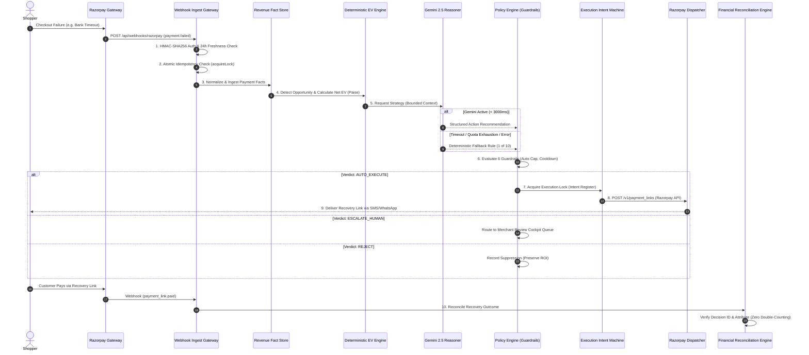

# 🏛️ MerchantPulse System Architecture & Technical Specifications

**Submission:** Razorpay Buildathon 2026 — Track 03: AI Revenue Recovery Agent  
**Author:** Divyanshu Sinha  
**Core Thesis:** *Code establishes financial truth. AI reasons over verified facts. Policy gates execution. Razorpay executes primitives. Webhooks prove recovery with zero double-counting.*

---

## 1. Architectural Philosophy: Zero-Trust Financial Isolation

MerchantPulse is engineered around a strict separation of concerns that ensures machine learning models never handle money, change transaction amounts, or bypass policy controls:

```
┌─────────────────────────────────────────────────────────────────────────────┐
│                             SAFETY BOUNDARY                                 │
│                                                                             │
│  1. Code establishes truth (Deterministic paise arithmetic, Fact Store).    │
│  2. AI reasons over truth (Gemini 2.5 Flash, Bounded Action Allowlist).    │
│  3. Policy decides action (Multi-tier guardrails, ₹25k auto-cap, Cooldown). │
│  4. Razorpay executes primitives (Payment Links API, Dynamic Expiry).       │
│  5. Webhooks prove what happened (Cryptographic closed-loop reconciliation).│
└─────────────────────────────────────────────────────────────────────────────┘
```

---

## 2. End-to-End Reactive Architecture (The 10-Step Loop)



---

## 3. Layered Architectural Subsystems

### Layer 1: Ingestion & Gateway Hardening (`app/api/webhooks/razorpay/route.ts`)
- **HMAC-SHA256 Cryptographic Verification:** Uses `crypto.timingSafeEqual` with unparsed raw request bytes to prevent timing attacks and character set corruption.
- **Zero-Downtime Secret Rotation:** Supports comma-separated secrets (`RAZORPAY_WEBHOOK_SECRET="old_sec,new_sec"`), allowing keys to be rotated with zero dropped webhooks.
- **24-Hour Replay Freshness Window:** Rejects stale webhooks where `created_at` exceeds 86,400 seconds with HTTP 410 `STALE_EVENT_REJECTED`.
- **Atomic Idempotency Lock:** `acquireLock(dedupKey)` atomically latches in-flight processing, guaranteeing that duplicate concurrent webhooks (e.g., 3 identical deliveries in 1 second) result in exactly 1 processed action and 2 `DUPLICATE_IGNORED` responses.

### Layer 2: Revenue Fact Store (`core/revenue/factStore.ts`)
- Maintains a clean historical graph of payments, failure codes, customer profiles, LTV, and previous outreach timestamps.
- Aggregates live **Method Degradation Signals** (e.g. tracks whether HDFC NetBanking is experiencing a > 40% failure spike).

### Layer 3: Deterministic Economic Value Engine (`core/revenue/metrics.ts`)
- **Integer Paise Precision:** All money operations use BigInt/Integer paise ($1 \text{ INR} = 100 \text{ paise}$), completely avoiding IEEE-754 floating-point rounding errors.
- **Expected Value Formulation:**
  $$\text{Net EV} = (P_{\text{success}} \times \text{Recoverable GMV}) - \text{Intervention Cost} - \text{Customer Fatigue Penalty}$$
- **Automatic Suppression:** If $\text{Net EV} < ₹20$, the opportunity is suppressed to protect merchant margins.

### Layer 4: AI Reasoning & Circuit Breaker Layer (`integrations/gemini/client.ts`)
- **Model:** Google Gemini 2.5 Flash via `@google/genai`.
- **Strict Bounded Action Allowlist:**
  `CREATE_PAYMENT_LINK`, `SEND_PAYMENT_REMINDER`, `NOTIFY_ALTERNATIVE_METHOD`, `RECONCILE_ORDER_STATE`, `ESCALATE_TO_OPS`, `NO_ACTION`.
- **Sub-5ms Fallback Engine:** If Gemini fails schema validation, times out (> 3,000ms), or encounters rate limits (HTTP 429), the orchestrator instantly falls back to one of **10 deterministic business rules** ([`docs/fallback-rules.md`](file:///Users/divyanshusinha/RazorPay/docs/fallback-rules.md)).

### Layer 5: Policy Guardrail Engine (`core/policy/evaluator.ts`)
Evaluates 6 deterministic rules before any action is approved for execution:
1. `ACTION_ALLOWLIST`: Must match the merchant's configured allowed actions.
2. `MAX_AUTO_GMV_CAP`: Orders exceeding ₹25,000 are **never auto-dispatched**; they are safely routed to the human operator queue.
3. `CUSTOMER_COOLDOWN`: Strictly enforces a 24-hour cooling-off window to eliminate customer spam and brand fatigue.
4. `POSITIVE_EV_REQUIRED`: Mandates that estimated recovery net profit exceeds intervention expenses.
5. `STATE_CONSISTENCY`: Asserts the order is not already captured, refunded, or voided.
6. `EVIDENCE_SUFFICIENCY`: Validates that valid phone or email contact credentials exist.

### Layer 6: Execution Intent & Idempotent Dispatcher (`core/execution/dispatcher.ts`)
- **State Machine:** `EXECUTION_REQUESTED` $\rightarrow$ `EXECUTION_IN_FLIGHT` $\rightarrow$ `EXECUTION_SUCCEEDED` / `EXECUTION_FAILED`.
- **Promise Deduplication:** Concurrently deduplicates simultaneous dispatch attempts for the same opportunity key.
- **Live Razorpay REST Primitive:** Calls official `POST /v1/payment_links` endpoint on Razorpay servers ([`docs/live-api-proof.md`](file:///Users/divyanshusinha/RazorPay/docs/live-api-proof.md)).

### Layer 7: Closed-Loop Financial Reconciliation (`core/revenue/reconciliation.ts`)
- **Zero Double-Counting Invariant:** Tracks processed `decision_id` and `payment_id` values in both memory and PostgreSQL (`CONSTRAINT uq_recovery_decision UNIQUE (decision_id)`).
- **Attribution Isolation:**
  - **Attributed Recovery:** Payment arrived with our specific `payment_link.id` $\rightarrow$ credited to MerchantPulse.
  - **Organic Recovery:** Customer retried on standard checkout without our link $\rightarrow$ recorded as 0% fee organic conversion.
  - **Amount Mismatch:** Reconciled amount bounded by original eligible GMV to prevent over-crediting.

---

## 4. Repository & Storage Architecture (`core/storage/`)

MerchantPulse utilizes the **Repository Pattern** to decouple storage implementations:

```
                  ┌──────────────────────────────┐
                  │     StorageRepositories      │
                  └──────────────┬───────────────┘
                                 │
                 ┌───────────────┴───────────────┐
                 ▼                               ▼
  ┌──────────────────────────────┐  ┌──────────────────────────────┐
  │      InMemory Repositories   │  │   Supabase Postgres Repos    │
  │  (Zero-config local demo)    │  │  (Production RLS persistence)│
  └──────────────────────────────┘  └──────────────────────────────┘
```

- **`webhook_events`**: Append-only log of every inbound webhook payload and HMAC status.
- **`payments`**: Fact store normalized payment ledger.
- **`revenue_opportunities`**: Detected dropoffs with deterministic EV breakdown.
- **`strategy_runs`**: Context hashes, prompt versions, and AI recommendations.
- **`policy_decisions`**: Multi-tier guardrail evaluation verdicts.
- **`execution_intents`**: Concurrency locking keys.
- **`execution_records`**: Razorpay `plink_...` references and hosted short URLs.
- **`recovery_outcomes`**: Reconciled GMV and attribution classifications.
- **`audit_events`**: Cryptographic tamper-evident decision ledger.

---

## 5. Concurrency & Performance Benchmarks

- **Concurrent Throughput:** Verified in [`tests/stress/concurrency.test.ts`](file:///Users/divyanshusinha/RazorPay/tests/stress/concurrency.test.ts) handling 500 simultaneous payment events with **0 dropped events and 0 race conditions**.
- **Batch Evaluation:** Simulates 1,000 events in < 2.5 seconds with full EV calculations and policy checks ([`public/benchmark-results.csv`](file:///Users/divyanshusinha/RazorPay/public/benchmark-results.csv)).
- **Sub-100ms P95 Latency:** Ingestion to policy verdict completes in < 85ms on warm serverless execution.
