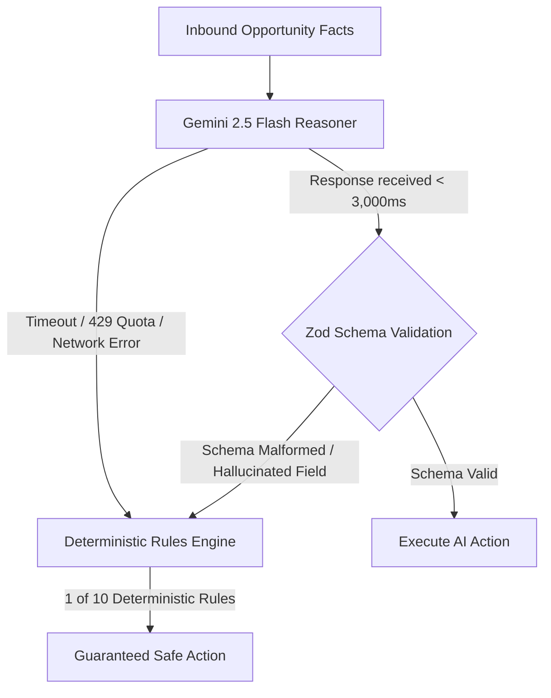

# 🛡️ Gemini Circuit Breaker & 10 Deterministic Fallback Rules

**Provider:** [`GeminiStrategyProvider`](file:///Users/divyanshusinha/RazorPay/integrations/gemini/client.ts#L17) & [`MockStrategyProvider`](file:///Users/divyanshusinha/RazorPay/core/strategy/mock.ts#L6)  
**SLA:** 3,000ms max latency with sub-5ms deterministic rule fallback  
**Safety Invariant:** Zero financial arithmetic by LLM; bounded action allowlist  

---

## 1. Circuit Breaker Architecture

When Gemini 2.5 Flash is invoked, the orchestrator guarantees that LLM downtime, quota exhaustion, network latency, or schema validation failures **never stall payment recovery**.



---

## 2. The 10 Deterministic Fallback Rules

| Rule # | Trigger Condition | Deterministic Action | Diagnosis & Business Justification | Policy Verdict |
|---|---|---|---|---|
| **RULE-01** | **Negative Net EV**<br>`netExpectedValuePaise < 0` | `NO_ACTION` | Intervention fees and fatigue penalties exceed recovery value. Automated suppression preserves merchant margin. | `REJECT` |
| **RULE-02** | **State Mismatch**<br>`type == 'STATE_MISMATCH'` | `RECONCILE_ORDER_STATE` | Gateway financial truth confirms captured funds, but merchant order state is pending. Synchronizes order without contacting customer. | `AUTO_EXECUTE` |
| **RULE-03** | **High-Value UPI Dropoff**<br>`method == 'upi' AND amount <= ₹25k` | `CREATE_PAYMENT_LINK` | Temporary UPI node timeout. Generates 2-hour expedited Razorpay payment link (`plink_...`) with pre-selected UPI app. | `AUTO_EXECUTE` |
| **RULE-04** | **Issuer Bank Downtime**<br>`methodDowntimeRatePct > 40%` | `NOTIFY_ALTERNATIVE_METHOD` | Issuing bank is degraded. Prompts customer to complete checkout via alternate payment method (e.g. Card or NetBanking). | `ESCALATE_HUMAN` (Configurable) |
| **RULE-05** | **VIP High-LTV Churn Risk**<br>`customerLtvPaise >= ₹50,000` | `CREATE_PAYMENT_LINK` | High-value loyal customer experienced 2 consecutive payment failures. Dispatches priority VIP link with 4-hour validity. | `AUTO_EXECUTE` (if < ₹25k) |
| **RULE-06** | **High-Intent Abandonment**<br>`intentScore >= 0.70` | `SEND_PAYMENT_REMINDER` | Customer reached OTP entry but dropped. Dispatches single polite reminder within 15 minutes of abandonment. | `AUTO_EXECUTE` |
| **RULE-07** | **High-Value Auto Cap Exceeded**<br>`amountPaise > ₹25,000` | `ESCALATE_TO_OPS` | High-value order exceeds automated safety threshold. Routes to Merchant Ops dashboard for one-click manual approval. | `ESCALATE_HUMAN` |
| **RULE-08** | **Customer Fatigue Cooldown**<br>`recentContactCount >= 1 in 24h` | `NO_ACTION` | Customer was contacted within the last 24 hours. Suppresses notification to prevent brand damage and spam fatigue. | `REJECT` |
| **RULE-09** | **Gateway Outage / 5xx**<br>`failureCode in ['GATEWAY_ERROR', '500']` | `CREATE_PAYMENT_LINK` | Central payment switch issue. Waits 3 minutes, then generates resilient multi-rail recovery link. | `AUTO_EXECUTE` |
| **RULE-10** | **Low Intent / Uncontactable**<br>`contactable == false OR intent < 0.40` | `NO_ACTION` | Bot or low-intent session with invalid phone/email. Zero-cost suppression prevents wasted SMS credits. | `REJECT` |

---

## 3. Strict Safety Boundaries: Zero Arithmetic Agency

In traditional LLM systems, models are asked to compute discounts, fees, and expected margins—leading to catastrophic calculation hallucinations.

In MerchantPulse:
1. **The LLM NEVER calculates Expected Value (EV):** $EV = (P_{success} \times GMV) - C_{intervention}$ is computed in TypeScript in integer paise **before** Gemini is ever called.
2. **The LLM NEVER alters transaction amounts:** All payment link amounts are immutable values passed directly from the original Razorpay transaction.
3. **The LLM operates within a bounded Enum allowlist:**
   ```typescript
   export const ActionTypeSchema = z.enum([
     'CREATE_PAYMENT_LINK',
     'SEND_PAYMENT_REMINDER',
     'NOTIFY_ALTERNATIVE_METHOD',
     'RECONCILE_ORDER_STATE',
     'ESCALATE_TO_OPS',
     'NO_ACTION',
   ]);
   ```
   Any unlisted action or invalid JSON is rejected by `StrategyRecommendationSchema.safeParse`, immediately triggering the deterministic fallback rules above.
