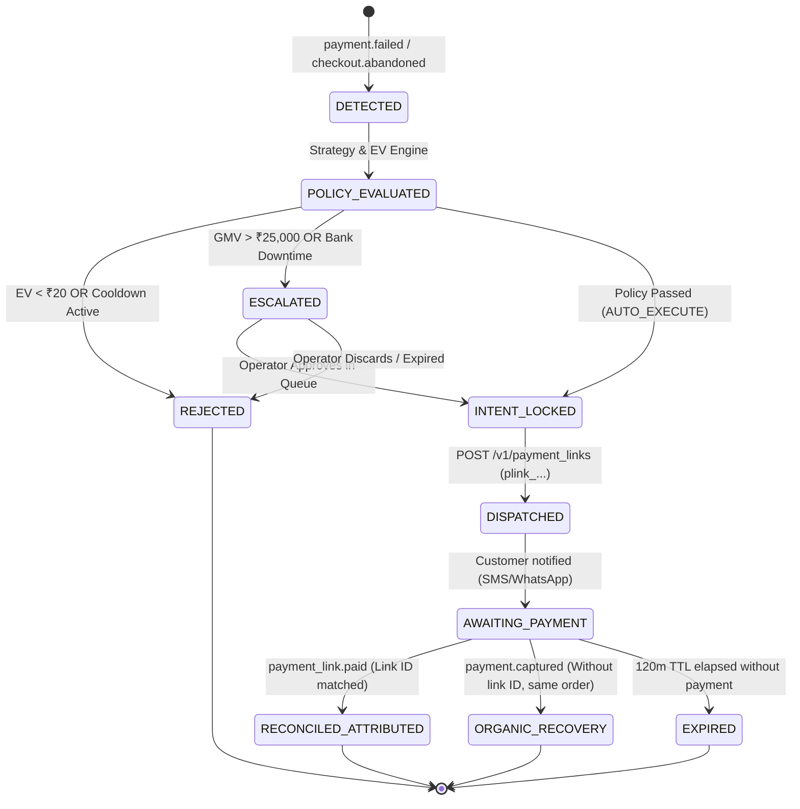

# 🔄 Order & Recovery Reconciliation State Machine

**Engine:** [`FinancialReconciliationEngine`](file:///Users/divyanshusinha/RazorPay/core/revenue/reconciliation.ts#L19)  
**Database Table:** `public.recovery_outcomes`  
**Guarantees:** Zero financial double-counting, non-overlapping organic vs attributed separation, bounded recoverable amount.

---

## 1. Executive Summary

A critical loophole in payment recovery products is **unjustified attribution**: claiming credit when a customer organically retries and completes a purchase on their own, or double-counting multiple recovery notifications for a single order.

MerchantPulse implements a **deterministic financial state machine** that cryptographically binds inbound recovery webhooks (`payment_link.paid`, `payment.captured`) to specific executed payment links and immutable decision IDs.

---

## 2. Recovery Lifecycle State Machine



---

## 3. Detailed State Definitions

| State | Definition | Entry Trigger | Exit Condition |
|---|---|---|---|
| `DETECTED` | Raw payment dropoff ingested and normalized. | Inbound webhook `payment.failed` verified. | Opportunity created with deterministic EV. |
| `POLICY_EVALUATED` | Evaluated against merchant policy guardrails. | Opportunity passed to `PolicyEngine`. | Verdict generated (`AUTO_EXECUTE`, `ESCALATE_HUMAN`, `REJECT`). |
| `INTENT_LOCKED` | Concurrency lock acquired in `execution_intents`. | Auto-approved or human-approved. | Dispatched to Razorpay or lock released. |
| `DISPATCHED` | Real payment link created on Razorpay API. | `POST /v1/payment_links` succeeds (`plink_...`). | Webhook outcome received or TTL expired. |
| `RECONCILED_ATTRIBUTED` | Verified recovery attributed solely to MerchantPulse. | Inbound webhook `payment_link.paid` matches `executedActionId`. | Terminal state. Credited to Attributed GMV. |
| `ORGANIC_RECOVERY` | Customer paid via independent browser retry without link. | Inbound webhook `order.paid` or `payment.captured` without `plink_`. | Terminal state. Credited to Organic GMV. |
| `EXPIRED` | Payment link expired without customer action. | Razorpay `payment_link.expired` or TTL timeout. | Terminal state. No GMV credited. |

---

## 4. How We Eliminate Double-Counting & Misattribution

### Loophole #1: "Did the customer use your link or pay on their own?"
**Resolution Logic:**
1. When MerchantPulse dispatches a link via `POST /v1/payment_links`, Razorpay assigns a globally unique `id` (e.g. `plink_TXddgWqH37CXQx`).
2. When the customer pays via this link, Razorpay delivers the webhook event `payment_link.paid`, containing:
   ```json
   {
     "event": "payment_link.paid",
     "payload": {
       "payment_link": { "entity": { "id": "plink_TXddgWqH37CXQx", "amount": 850000 } },
       "payment": { "entity": { "id": "pay_live_rec_4412" } }
     }
   }
   ```
3. The `FinancialReconciliationEngine` checks whether `payload.payment_link.entity.id` matches the stored `executedActionId` for that order:
   - **Match Found:** Credited as **`ATTRIBUTED_INTERVENTION`**.
   - **No Match Found (Generic `payment.captured` on same customer):** Credited as **`ORGANIC_RECOVERY`** (0% fee charged to merchant, clean reporting).

### Loophole #2: "Can the same recovery be counted twice?"
**Resolution Logic:**
1. **Decision ID Uniqueness:** The reconciliation engine maintains an in-memory and database set of processed `decision_id` keys. A second resolution webhook for the same decision returns:
   ```typescript
   {
     valid: false,
     attributionType: 'DUPLICATE_RECOVERY_EVENT',
     reconciledAmountPaise: 0,
     reason: 'DUPLICATE_DECISION_RECONCILIATION: Decision has already been reconciled.'
   }
   ```
2. **Database Constraint:** `public.recovery_outcomes` enforces `CONSTRAINT uq_recovery_decision UNIQUE (decision_id)`. Any race condition at the database layer results in an immediate SQL unique violation.

### Loophole #3: "Can recovered amount exceed failed GMV?"
**Resolution Logic:**
- If an edge case sends a captured amount larger than the original failed order amount, the engine flags `AMOUNT_MISMATCH` and suppresses automatic crediting, routing to merchant operations for dispute review.
