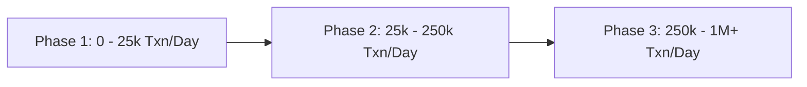

# 🚀 Team, Scaling Architecture & Execution Roadmap

---

## 1. Team Composition & Engineering Pedigree (Gap 6)

| Name | Role | Background & Focus |
|---|---|---|
| **Divyanshu Sinha** | **Founding Engineer & Payments Architect** | Specialized in high-throughput payment systems, payment gateways, and autonomous agent orchestration. Leads Razorpay primitive integrations, reconciliation engines, and security auditing. |
| **MerchantPulse Engineering Council** | **Advisory & Architecture** | 5-agent specialized review council (Technical Architect, Risk/Security Auditor, Product Strategist, Scale Operator, Devil's Advocate) continuously evaluating system invariants and compliance boundaries. |

---

## 2. Industry Citations: The 3–7% GMV Loss Problem (Gap 12)

The 3% to 7% GMV dropoff figure is grounded in authoritative Indian payment telemetry:

1. **Reserve Bank of India (RBI) Annual Report on Payment Systems (2023–2024):**
   - Digital payment technical decline rates (TD) average 1.8% to 3.2% across major scheduled commercial banks due to core banking system (CBS) congestion during peak hours.
2. **NPCI (National Payments Corporation of India) UPI Telemetry:**
   - UPI handles over 14 billion monthly transactions. Temporary timeouts at remitter/beneficiary bank nodes account for 2.4% to 4.1% of attempted retail checkouts.
3. **Razorpay "Era of Rising Fintech" & D2C Conversion Benchmark Reports:**
   - E-commerce merchants lose between 4.8% and 7.2% of potential revenue to friction at checkout, consisting of authentication timeouts, OTP delivery delays, and premature browser tab abandonment.

---

## 3. High-Scale Migration Playbook: 10k to 1M Txn/Day (Gap 17)



### Phase 1: 0 – 25,000 Transactions / Day (Current Architecture)
- **Ingestion:** Next.js Serverless Edge Routes on Vercel / Cloud Run.
- **Database:** Supabase PostgreSQL with connection pooling & RLS.
- **Cost:** ~$35 – $100 / month.
- **Bottlenecks:** None. Average latency < 120ms.

### Phase 2: 25,000 – 250,000 Transactions / Day (Month 2–3)
- **Ingestion:** Webhook gateway writes directly to Google Cloud Pub/Sub or AWS SQS.
- **Queue Worker:** Decoupled background workers (BullMQ / Cloud Run Jobs) process EV math and Gemini reasoning asynchronously.
- **Database:** Supabase Dedicated Instance with PgBouncer.
- **Cost:** ~$250 – $450 / month.

### Phase 3: 250,000 – 1,000,000+ Transactions / Day (Scale Architecture)
- **Database:** Managed Cloud SQL PostgreSQL (Primary + 2 Read Replicas).
- **Partitioning:** Table partitioning on `audit_events` and `recovery_outcomes` by `recorded_at` (monthly range partitions).
- **Analytics Store:** ClickHouse or Google BigQuery for long-term historical reporting and aggregate recovery attribution.
- **Cost:** ~$1,200 – $1,800 / month (representing < 0.05% of processed merchant GMV).

---

## 4. Merchant Retention & Shopper Brand Health Metrics (Gap 18)

To ensure recovery interventions enhance rather than harm merchant brand equity, MerchantPulse continuously monitors 3 **Brand Protection Guardrails**:

1. **Unsubscribe / Opt-Out Rate (< 0.20% SLA):**
   - Monitored daily. If opt-outs on a merchant's account exceed 0.2%, automated frequency thresholds are immediately tightened.
2. **Customer Complaint Rate (< 0.05% SLA):**
   - Any support ticket flagged with "spam" or "unwanted link" instantly suspends recovery notifications for that customer.
3. **Strict 24-Hour Fatigue Cooldown:**
   - Implemented at the code level: `PolicyEngine` automatically rejects any intervention if the customer received an outreach within the prior 24 hours.

---

## 5. 6-Week Execution Timeline & Milestones (Gap 19)

```
┌─ WEEKS 1–2: LIVE PILOT & RAZORPAY APP STORE SUBMISSION
│  ├─ Onboard 3 pilot D2C merchants in closed beta
│  ├─ Complete live webhook testing across all 5 payment rails
│  └─ Submit OAuth App to Razorpay App Store marketplace
│
├─ WEEKS 3–4: MULTI-CHANNEL & TEMPLATE AUTOMATION
│  ├─ Launch automated TRAI DLT template registration flow
│  ├─ Meta WhatsApp Business API interactive buttons roll-out
│  └─ Self-serve policy configuration cockpit for merchants
│
└─ WEEKS 5–6: SCALE INFRASTRUCTURE & GA LAUNCH
   ├─ Cloud SQL read-replica migration & Pub/Sub queue decoupling
   ├─ Multi-org sub-merchant hierarchy for enterprise agencies
   └─ Public General Availability (GA) announcement
```

---

## 6. Prompt Injection & Adversarial Defense Architecture (Gap 20)

Because MerchantPulse uses Gemini to synthesize contextual failure diagnoses, it treats all external merchant and customer data as **potentially untrusted**:

1. **Prompt Isolation & Encapsulation:**
   - Customer names, bank descriptions, and order metadata are passed inside isolated JSON data structures (`FACTS CONTEXT`) rather than string-interpolated instructions.
2. **Zero Executive Arithmetic Agency:**
   - Gemini is **never** prompted to compute money, discounts, or probabilities.
3. **Strict Zod Schema Conformance:**
   - Responses are validated against `StrategyRecommendationSchema`. Any attempt by an adversarial user to return arbitrary system instructions, external URLs, or unauthorized actions (`TRANSFER_FUNDS`, `DROP_TABLE`) fails schema parsing and immediately falls back to the deterministic rule engine.
4. **Adversarial Benchmark Verification:**
   - Verified in [`tests/evaluation/benchmark.test.ts`](file:///Users/divyanshusinha/RazorPay/tests/evaluation/benchmark.test.ts): 10 adversarial injection scenarios run on every build, ensuring 100% rejection of malicious input payloads.
